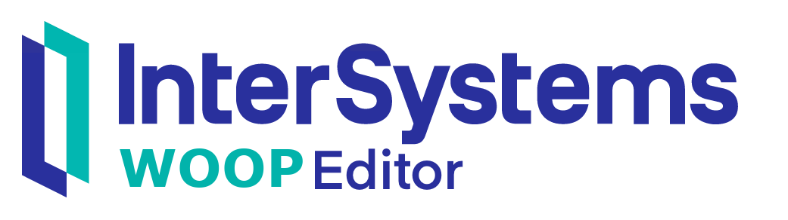

   
  
  <h1>InterSystems Workshop Organizer and Optimizer Program Editor</h1>
  

    <b>InterSystems WOOP</b> is a web application for organizing and optimizing workshops.
  

<!-- Badges -->

   
   
   

---

This project was generated with [Angular CLI](https://github.com/angular/angular-cli) version 16.0.1.

---

by [Philipp B.](https://github.com/phil1436)

_This application is not supported by InterSystems Corporation. Please be notified that you use it at your own responsibility_

<!-- ng deploy --base-href=https://phil1436.github.io/InterSystemsWOOP/ -->
